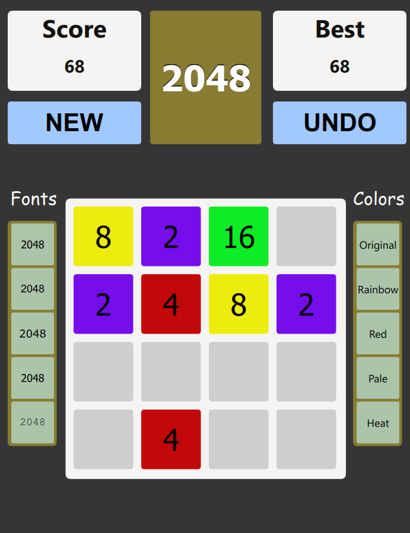

# The 2048 Game

** It is recommended to run the application using the "MINGW" kit.**  
**If another kit is used, an error may appear. In that case, please click the 'Ignore' button to continue running the application.**

## Description

This class project aims to demonstrate the use of C++ in combination with Qt and QML to develop an interactive graphical interface.

The project is divided into two main parts: the backend in C++ and the frontend in QML. The backend manages the application logic, while the frontend handles the user interface.

## Game Mechanics

2048 is a puzzle game where the player must merge numbered tiles to reach the tile with the number 2048.

### Game Controls

- **Movement:** Tiles move in the up, down, left, or right directions using the arrow keys.
- **Merge:** When two tiles with the same number collide, they merge into one tile with the sum of their values.
- **Game Over:** The game ends when the grid is full and no more moves are possible, or when the player reaches the 2048 tile.

### Customization Options

In addition to the game controls, two buttons and two menus are available to customize the experience:

- **UNDO:** Cancels the last move made, useful for correcting a mistake or trying different strategies.
- **NEW:** Starts a new game, resetting the grid.
- **FONTS:** Allows the user to choose from a selection of fonts for tile display.
- **COLORS:** Allows the user to customize the color of the tiles and the background according to preference.

### Game Interface

---
